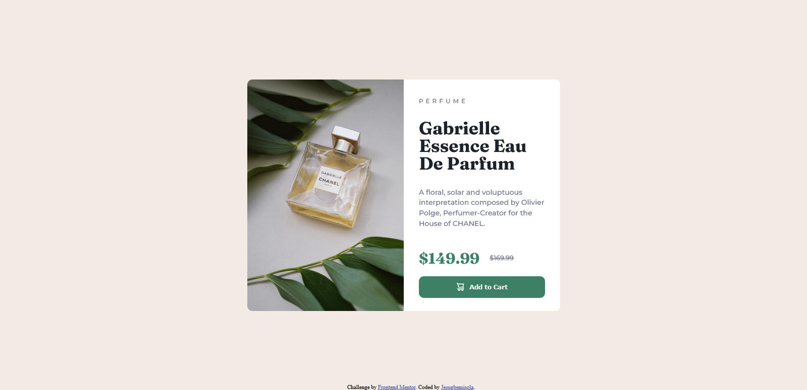

# Frontend Mentor - Product preview card component solution

This is a solution to the [Product preview card component challenge on Frontend Mentor](https://www.frontendmentor.io/challenges/product-preview-card-component-GO7UmttRfa). Frontend Mentor challenges help you improve your coding skills by building realistic projects. 

## Table of contents

  - [The challenge](#the-challenge)
  - [Screenshot](#screenshot)
  - [Links](#links)
  - [Built with](#built-with)
  - [What I learned](#what-i-learned)
  - [Continued development](#continued-development)
  - [Useful resources](#useful-resources)
  - [Author](#author)


### The challenge

Users should be able to:

- View the optimal layout depending on their device's screen size
- See hover and focus states for interactive elements

### Screenshot




### Links

- Solution URL: [Add solution URL here](https://your-solution-url.com)
- Live Site URL: [Add live site URL here](https://your-live-site-url.com)


### Built with

- Flexbox
- CSS Grid

### What I learned

I learnt how to use CSS flexbox, flex wrap

```css
.product-price {
  display: flex;
  flex-wrap: wrap;
  align-items: center;
}
```

### Continued development

This was my first work on building a responsive website. Am glad I took this challenge and will continue to work on grasping the ways to make a site very responsive.


### Useful resources

- [Josh Comeau CSS Reset](https://www.joshwcomeau.com/css/custom-css-reset/) - This helped me with reset the default CSS styling. I really liked this pattern and will use it going forward.


## Author

- Frontend Mentor - [@Jesug][https://www.frontendmentor.io/profile/Jesug]
- Twitter - [@OmoniyiJesugbe1][https://twitter.com/OmoniyiJesugbe1]


